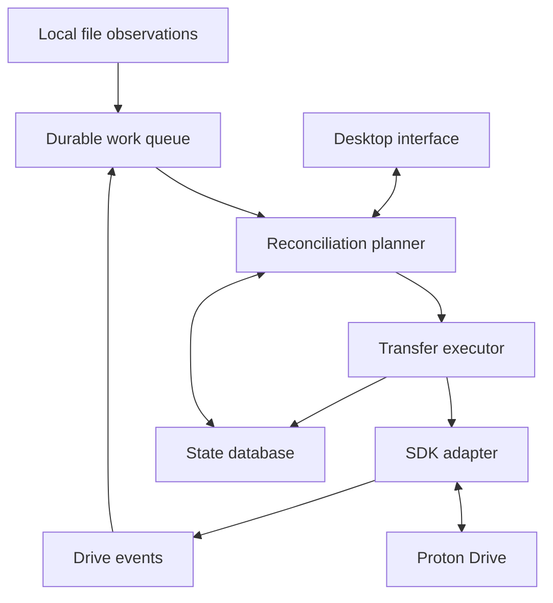

# Proton Drive on Linux Engineering Briefing

**Prepared for the maintainers of this fork (written for Nizar, its first user)**  
**Research snapshot 3 October 2026**  
**Purpose** Explain the current Arch Linux workaround, identify what it actually guarantees, and choose a useful path into Proton Drive development.

## Recommended starting point

Keep the working nightly workflow while improving its correctness and observability. Start with a small contribution to `lafontaj/proton-drive-cli-sync`, then use a separate experimental project to learn Proton’s SDK and remote event model. Before committing to a new synchronization engine, discuss the boundary of Proton’s upcoming Linux daemon and reusable sync component with its maintainers.

There is already useful work available at every layer. A reliable Arch package, clear unattended authentication behavior, accurate failure reporting, and regression tests would help immediately. A complete two-way client is a substantially larger undertaking because it must reconcile independent edits and deletions without losing data.

Three findings shape this recommendation:

- The existing repository is a **one-way local-to-cloud tool**. Its current upstream version includes a Tkinter GUI, local change watchers, optional NAS support, and systemd scheduling. It does not download remote changes or perform two-way reconciliation. [Repository overview][wrapper]
- Proton supplies a native Linux CLI and a cross-platform SDK. The missing official desktop experience is continuous synchronization and integration around those building blocks. The official download page still lists Windows and macOS desktop apps, plus a Linux-capable CLI. [Official downloads][downloads] [CLI introduction][cli-launch]
- A local reproduction against the reviewed wrapper source confirmed that its default comparison can miss an edit that preserves the file’s byte count. This is an actionable first correctness issue, not evidence that Nizar’s installation has already lost changes. The installed revision and configuration have not been inspected.

# 1. My situation and the intended outcome

I use an Arch-based Linux system and want Proton Drive to fit into an ordinary desktop workflow: files should be accessible through my file manager, changes should reach the cloud automatically, and synchronization status should be understandable.

My current solution is the community repository [lafontaj/proton-drive-cli-sync](https://github.com/lafontaj/proton-drive-cli-sync). It implements synchronization logic around Proton’s official `proton-drive` executable. I schedule it at midnight using `proton-sync.timer` and `proton-sync.service`. This is functional for my present needs. I want to understand the implementation well enough to contribute upstream or help build a better Linux application.

Those are the facts supplied about my installation. My exact distribution, desktop environment, file manager, repository commit, CLI version, mappings, deletion settings, authentication backend, and effective unit files remain unknown. In particular, the repository’s Mint/NAS examples describe its author’s environment; they do not establish that I use a NAS, multiple Proton accounts, or its real-time services.

The engineering goal should distinguish four experiences:

| Experience | Meaning | What it requires |
| --- | --- | --- |
| Scheduled upload or backup | Local files are copied to Drive periodically | Transfer operations, change detection, scheduling, useful failure reporting |
| One-way mirror | A selected local tree determines the remote contents, including optional removals | Everything above plus explicit deletion policy and safeguards |
| Two-way synchronization | Changes on either side converge while concurrent changes are preserved or resolved | Persistent common history, remote events, local observation, conflict handling, recovery |
| Mounted cloud filesystem | Remote storage appears at a local path, possibly fetching content on demand | FUSE or another filesystem layer, caching, writeback, offline behavior, filesystem semantics |

A mount does not automatically provide a complete offline replica. A file-manager bookmark into a real synchronized directory can provide useful integration without FUSE. A tray icon or web wrapper does not, by itself, supply a synchronization engine.

# 2. The official Proton landscape

### What exists today

Proton announced the official Drive CLI on 9 June 2026. Its purpose is scripted file operations: listing, uploading, downloading, trashing, and sharing. Proton explicitly distinguishes it from the background synchronization engine in its applications. JSON output is available for automation. [CLI introduction][cli-launch] [Usage guide][cli-support]

The release index retrieved for this review identifies **CLI 0.8.0, released 13 August 2026**, with Linux x64, x64-baseline, ARM64, and musl variants. The wrapper also names 0.8.0 as its tested CLI version. These are two separate observations: the published release and the wrapper’s compatibility target. An installed binary still needs to be checked. [Release index][cli-download] [Wrapper compatibility notes][wrapper]

This is not an Arch-only absence. Official Linux file operations exist; a released official Linux desktop sync application was not present on the download page reviewed. Installing an AUR wrapper would not turn a community application into an official Proton client. [Official downloads][downloads]

The current CLI documentation uses browser sign-in and supports an OS secret store by default, with `pass` as an alternative through `PROTON_DRIVE_CREDENTIALS_STORE`. On Linux, verify that the chosen Secret Service provider is available in the service’s session. A `pass` setup also needs its GPG key to be usable unattended; switching backends does not automatically solve locked credentials. Check support in the installed release before adopting options documented on development `main`. [CLI authentication and storage][cli-readme]

### What Proton says is coming

In its second-half-of-2026 technical roadmap, Proton’s engineering director describes a planned Linux beta initially centered on a **headless sync daemon**. A GUI follows, with the summary placing it in 2027. The same update describes adapting the Windows sync engine for macOS and Linux and preparing it for third-party SDK consumption. These are development intentions, not evidence that a beta has shipped or a guarantee about Arch packaging. [Engineering roadmap][roadmap]

The SDK README estimates the next cryptographic migration for late 2026 or early 2027; the engineering update says Crypto v2 will slip to 2027. Preserve that difference when planning. Neither source supplies a definitive service cutover date. Build an upgrade path and watch release notes. [SDK status][sdk-root] [Engineering roadmap][roadmap]

### What the SDK is and is not

The SDK’s current public core provides Drive operations and remote events. Its root README still marks the high-level Sync module as coming soon. Interfaces remain unstable; personal noncommercial experimentation is contemplated, while third-party production use is not yet supported. It recommends using the SDK rather than implementing the raw Drive protocol. [SDK status][sdk-root]

The available native implementations are **TypeScript and C#**, with incubating Kotlin and Swift bindings over C#. This is a cross-platform Drive SDK, not a separate product called the Linux SDK. There is also incubating search work; the root-level roadmap labels should not be read as saying no search implementation exists anywhere in the tree. [Client modules][sdk-client] [Incubating modules][sdk-incubating]

Core SDK scope excludes login, session management, and the user-address provider. The repository does contain a temporary account module under `incubating/account`, and the CLI wires these dependencies together. Treat that as an integration reference, not a stable standalone account SDK. [SDK scope][sdk-root] [Account module][sdk-account] [CLI initialization][sdk-init]

### Why encryption matters to application design

The SDK accepts file operations at a higher level than encrypted blocks and key handling. For a Linux application, it is sensible to let Proton’s implementation own that boundary. The application still owns local file access, durable state, scheduling, user interaction, and reconciliation policy. Encryption does not determine whether a missing file represents a deletion, a disconnected mount, or a temporarily unreadable directory.

Likewise, end-to-end encryption protects the service boundary; it does not encrypt a downloaded local replica on disk. Session secrets, filenames in logs, local indexes, and plaintext working files require deliberate local handling. These are design responsibilities for the proposed client, not claims that the reviewed wrapper exposes secrets.

# 3. How the current repository works

### Review scope and reproducibility

The following source snapshots were inspected:

| Repository | Reviewed commit | Commit date |
| --- | --- | --- |
| `lafontaj/proton-drive-cli-sync` | `5a852e218d353209a3b39cabdb4b810d0f254177` | 2 October 2026 |
| `ProtonDriveApps/sdk` | `28ac9cdc258737375692d1751dd9c7edcfb96708` | 2 October 2026 |
| `ProtonDriveApps/windows-drive` | `6189d7958ad9c0afe43734b939e7e078d430c00a` | 24 September 2026 |

The review followed the wrapper’s batch engine, comparison and cache logic, scheduling, local watcher, queue consumer, configuration, mount guard, and relevant GUI behavior. It also examined the SDK’s public client surface, CLI initialization and transfer reporting, and the Windows sync/platform boundary. This is a focused source review, not a comprehensive security audit.

Only isolated comparison functions were executed, using temporary local files and synthetic remote metadata. No Proton account was used, no cloud mutations were performed, and Nizar’s machine or systemd units were not inspected. Community alternatives below were assessed from their own documentation, not installed and exercised.

### Component map

| Component | Responsibility | Useful reading entry point |
| --- | --- | --- |
| `proton_mapping_editor.py` | Tkinter interface for mappings, manual runs, cache preparation, scheduling, real-time setup, settings | Startup checks and calls into the engine and managers |
| `proton_sync.py` | Local scan, remote listing, upload selection, cache, optional remote trashing | `main`, `sync_folder`, `needs_upload`, `upload_batch`, `sync_subpath` |
| `config.py` | Shared settings, executable resolution, state paths and migration | `DEFAULTS`, `resolve_proton_cli`, state-path constants |
| `schedule_manager.py` | Generates and controls user systemd service/timer units | `build_service_text`, `build_timer_text` |
| `local_watcher.py` | Watches local filesystem activity through pyinotify and writes queued markers | `marker_for_event`, `write_marker`, `run_watcher` |
| `realtime_consumer.py` | Debounces and processes queued paths through the batch engine | `DebounceState`, `run_engine_subpath`, processing of engine exit codes |
| `nas_watcher.py` and `realtime_manager.py` | Optional NAS observation and service management | Read only when adding remote filesystem support |
| `mount_check.py` | Checks whether a source is present, readable, and on the expected filesystem kind before deletion | `source_is_safe_for_delete` |
| `tray_indicator.py`, `i18n.py`, `locale/` | Desktop status and translations | Presentation work after engine behavior is understood |

Sources: [engine][engine], [configuration][config], [scheduler][scheduler], [local watcher][watcher], [queue consumer][consumer], [GUI][gui], and [repository tree][wrapper-tree].

### A scheduled pass

The midnight timer launches the service; the service launches the Python engine with a mappings file; the engine invokes the official CLI for remote operations. The CLI supplies authenticated, SDK-backed access to Drive. The Python layer supplies the mapping policy and decisions about what to transfer.

For a folder mapping, `source` identifies the local directory and `dest_parent` identifies its remote parent. The engine appends the local folder’s basename. For example, a source ending in `Documents` with parent `/my-files/Backups` targets `/my-files/Backups/Documents`. It does not mean “copy the contents directly into Backups.” Per-mapping settings include exclusions, `allow_delete`, `source_kind`, and file conflict behavior. [Mapping example][mappings] [Engine][engine]

The normal pass:

1. Acquires a per-user `flock`, verifies the CLI, and probes authentication by listing the remote root. It also compares the current Proton account with the cache’s account stamp when both identities are known.
2. Reads local directory entries and constructs a signature containing directory modification time, direct filenames, file sizes and modification times, destination, and exclusion fingerprint.
3. Uses a fresh signature to skip the remote listing for that directory. It still descends into local subdirectories, which have their own cache entries.
4. For a directory needing inspection, ensures the remote path exists, lists its children, and selects files for upload.
5. Uploads batches and handles individual retries after some failures. Optional deletion logic trashes remote entries absent from the selected local view.
6. Updates the cache and publishes health information for full passes. The cache is written via a temporary file followed by replacement, with periodic saves during long runs. [Engine][engine]

The current configuration centralizes state under `~/.proton-drive-sync/`, including its cache, queue, logs, lock, and health files. Some README sections and fallback code still mention older `~/.proton_sync*` locations. Follow the actual `config.py` and the installed revision when diagnosing an installation. [Configuration][config]

### Real-time mode is a second trigger mechanism

The current upstream project can observe local changes, persist markers, debounce bursts, and invoke the engine for affected subpaths. It moves markers aside while a run is active so another local change can enqueue new work. It also has recovery logic for interrupted work. This is considerably more than a timer wrapped around an unconditional upload. [Local watcher][watcher] [Queue consumer][consumer]

A real-time pass can propagate deletions when requested and permitted. Some engine help text still calls subpath mode purely additive, but `sync_subpath` implements the deletion gates. Initial cache completeness also matters: unknown subtrees can be deferred until a full pass prepares them. [Subpath implementation][engine-subpath]

These watchers observe **local or NAS changes**, not edits made through Proton’s web, mobile, or other desktop clients. They therefore reduce local upload latency without turning the tool into two-way sync. Nizar has only confirmed use of the nightly service, not activation of this layer.

# 4. Findings that should guide the first contributions

### Same size edits can be missed

**Confirmed by isolated execution of the reviewed functions.** `_local_signature` notices a modification-time change, but `needs_upload` makes its default decision using existence and byte count. It extracts remote modification time elsewhere without comparing that time here. Equal sizes return “no upload” unless optional hash checking has a remote SHA-1 digest to compare. [Signature function][engine-signature] [Comparison function][engine-comparison]

The reproduction replaced four bytes `AAAA` with four bytes `BBBB` and advanced the local modification time:

| Check | Observed result |
| --- | --- |
| Did the local directory signature change | Yes |
| Did the default comparator request upload | No |
| Did `verify_hash=True` detect the change with the old remote digest present | Yes |
| Did hash mode request upload when equal-size remote metadata had no digest | No |

Consequently, cache invalidation alone does not fix the issue. `--ignore-cache` forces inspection but still reaches the same size-based comparator. `--verify-hash` is useful where the remote digest is available, but is not an unconditional proof that all content matches.

**Suggested first patch:** make the intended one-way policy explicit, add regression cases, and retain per-file evidence of the last successful transfer. Use metadata for inexpensive candidate selection, then a content check or conservative upload decision for changed candidates. Define behavior when remote metadata is unavailable. Merely adding another cache invalidation rule would leave the upload decision incorrect.

Also test equal-size replacement during partial batch failure. `upload_batch` uses the default comparator when deciding whether a failed batch already uploaded a file; an old equal-size remote object could be mistaken for a successfully replaced one. This consequence follows from the call path and still needs an end-to-end or mocked batch regression. [Batch recovery][engine-upload]

### Process success does not always mean transfer success

**Source-confirmed control flow.** Individual upload and listing failures can make a folder incomplete without making the top-level batch process exit nonzero. In subpath mode, `sync_subpath` does not propagate the completion boolean returned by `sync_folder`; the main path normally returns successfully. The real-time consumer cleans processed markers when the child exits with code zero. [Engine entry point][engine-main] [Subpath implementation][engine-subpath] [Consumer][consumer]

This creates a retry and observability gap: “service succeeded,” “process finished,” and “all selected files reached Drive” are different states. A later batch scan may recover work, but that is different from reliable immediate retry. The repository already has failure logs, stable output tags, and health information; the next improvement is to make these consistent across batch, subpath, GUI, and systemd behavior.

**Suggested patch:** introduce a structured run result covering completed, partially failed, deferred, authentication unavailable, account mismatch, and lock contention. Propagate it end to end; only acknowledge queued work after the required operations succeed. Coordinate exit-code changes with the scheduler so a persistent error cannot create a tight retry loop.

### Local cache freshness cannot establish remote freshness

**Design limit established by the source.** The wrapper’s cache is based on local state. An unchanged local directory can skip a remote listing, so edits, deletions, or additions made in Drive need not be noticed. For a deliberately one-way workflow, this can be acceptable, but it must be stated as part of the ownership model. [Directory traversal and cache use][engine-folder]

An option named `revision` changes how an uploaded replacement is stored; it does not resolve independent local and remote edits. Two-way work needs remote identities, revisions, event cursors, and a common baseline. Those cannot be inferred from “the local folder has not changed.”

### Deletions and exclusions have consequential semantics

The code requires the master deletion request, the mapping’s `allow_delete`, and a passing mount guard before ordinary deletion propagation. Missing `mount_check.py` causes deletion to be refused. Remote listing failures are represented separately from an empty directory and cause that directory to be skipped. These are useful safeguards worth preserving. [Engine][engine] [Mount guard][mount-guard]

However, deletion identifies remote names absent from the **nonexcluded local names**. Adding an exclusion can therefore remove an already uploaded remote item during a subsequent deletion-enabled reconciliation. Remote-only items can also be treated as orphans. This fits a mirror policy but can surprise someone who expects an exclusion to mean “leave the remote copy alone.” [Directory traversal][engine-folder]

At this snapshot, `remote_trash` always uses the trash operation, even when legacy configuration requests permanent deletion. The implementation deliberately declines ambiguous permanent deletion by trash pathname. Some comments and configuration examples still describe the older behavior. [Trashing implementation][engine-trash]

A useful contribution would define and test exclusion policy explicitly: preserve excluded remote data, prune it only on request, or preserve the current mirror semantics with a clear preview. A mount guard also needs tests for a mount disappearing after validation; the current check is not a transaction covering the entire pass.

### Settings and historical workarounds need to be understood

The engine can rename local file extensions to lowercase as a historical MIME-detection workaround. `config.py` still defaults this setting to enabled, while the GUI performs a one-time automatic disabling for a sufficiently new CLI. A headless path should not assume that GUI migration has run. Inspect the effective setting; a backup operation can otherwise change local filenames. [Configuration][config] [GUI migration][gui-rename]

The engine follows symlinks to regular files during upload selection, but does not recurse through symlinked directories in the same way. That behavior should be documented and tested before promising POSIX metadata preservation or restricting uploads to content physically contained within a root. [Directory traversal][engine-folder]

No general automated sync regression suite or CI workflow was visible in the wrapper snapshot. The NAS self-test utilities and glyph test serve narrower purposes. Adding a fake-CLI test harness around these cases would improve confidence without requiring real credentials for every test. This is an observation about the published tree, not a claim that the maintainer performs no testing. [Repository tree][wrapper-tree]

# 5. What midnight scheduling guarantees

Nizar’s effective units have not been supplied, so the following describes upstream generation, not the exact local installation.

The current scheduler generates a user service with `Type=exec`, bounded restarts, `RestartSec=120`, and a six-hour runtime ceiling. `SuccessExitStatus=0 2 4` treats ordinary completion, authentication failure, and account mismatch as successful service exits to avoid futile automatic retry. Code 1, including lock contention, can trigger a restart. Its generated timer includes `Persistent=true` and `RandomizedDelaySec=300`; its default time is 03:00, which Nizar has changed or replaced with midnight. [Scheduler source][scheduler]

Practical consequences:

- If those timer defaults are retained, “midnight” includes an added random delay of up to five minutes, plus systemd timing behavior.
- A persistent calendar timer catches a missed activation when it becomes active again. That is not a wake-from-suspend guarantee or proof that a missed upload completed.
- A user service may need lingering to remain available without a login session. Lingering does not unlock a desktop keyring.
- Authentication and network failures share the wrapper’s root-listing probe. A skipped run cannot automatically be diagnosed as a locked keyring.
- A green systemd result is insufficient evidence of a complete backup; correlate it with run-level results and an actual restore check. [Timer semantics][systemd-timer] [Installation notes][systemd-install] [Engine entry point][engine-main]

Collect this small read-only inventory before changing anything:

```bash
proton-drive version
systemctl --user cat proton-sync.service proton-sync.timer
systemctl --user list-timers --all proton-sync.timer
systemctl --user show proton-sync.service -p Result -p ExecMainStatus
journalctl --user -u proton-sync.service --since yesterday --no-pager
```

Use the configured absolute CLI path if it is not on `PATH`. Also record the installed repository commit with `git rev-parse HEAD` from its checkout, effective mapping flags, credential backend, and whether a graphical session exists at the scheduled time. Review logs before sharing them because paths and account identifiers can be personal.

# 6. Approaches worth considering

| Approach | Existing foundation | Engineering work remaining | Assessment for this situation |
| --- | --- | --- | --- |
| Improve the current Python wrapper | Working one-way workflow, mappings, GUI, timers, watchers | Correctness, result propagation, tests, packaging | Best immediate starting point |
| Build a desktop layer around the official CLI | Official auth and encrypted transfers | Persistent application state, reliable job control, status and possibly reconciliation | Good small prototype; subprocess contracts need care |
| Build directly on the official SDK | Typed operations, node identities, events and transfer control | Account integration, daemon, state database, reconciliation, UX | Best technical route to an independent experimental client |
| Integrate with Proton’s forthcoming daemon or sync module | Planned official engine | Public integration boundary, Linux testing, packaging, desktop UI | Highest potential reuse; availability and API must be confirmed |
| rclone or an rclone-based GUI | Existing transfer, sync and mount tooling | Proton backend compatibility and service behavior | Useful reference and experiment; backend limits matter |
| Existing community Rust client | Linux FUSE and desktop work already underway | Review maturity, correctness and upstream parity | Worth evaluating before creating another implementation |
| Windows in a VM or WinBoat | Official Windows application running on Windows | VM lifecycle, storage bridge, host integration | A workaround with substantial operational cost |
| Wine compatibility | Potential to run a Windows binary | Windows API and filesystem behavior compatibility | Research spike only; not a verified solution here |

### Community projects to evaluate

**rclone.** Its Proton backend documentation still labels the backend Beta and Tier 4, describes its independent implementation through Proton-API-Bridge, and warns that its cache does not incorporate changes made by other clients through Drive events. A mature rclone frontend does not remove those backend limitations. `rclone sync` is a directional mirror operation; two-way workflows use different machinery, such as bisync. Treat a mount and a synchronized local directory as different products. [Proton backend documentation][rclone] [Sync command][rclone-sync] [Bisync command][rclone-bisync]

**Protondrive-for-Linux.** The repository reached through `danslabs/protondrive-for-linux` describes a Go convenience wrapper that prefers the official CLI for supported operations and retains rclone for mounting and exact rclone sync behavior. Its official-CLI “sync” path maps to upload or download operations. This is useful integration work, but its command name alone does not establish two-way reconciliation. Backend selection changes semantics. [Project README][community-wrapper]

**proton-sdk-rs2 and pdcli.** This project describes itself as a community Rust port of Proton’s C# SDK, with a Linux FUSE client and desktop utility. Its README includes Arch build instructions. Evaluate it as a distinct community implementation, including its maintenance burden across Proton protocol changes; it is not an official Rust edition of the Drive SDK. [Project README][rust-client]

**Celeste.** This GTK4/libadwaita application advertises two-way synchronization through rclone and lists Proton Drive. Its original repository was archived on 21 November 2025. It is useful prior art for UI and conflict workflows, but the archived upstream is not an obvious destination for a new contribution without first finding a maintained continuation. [Project status][celeste]

These are candidates for evaluation, not recommendations to replace the working setup without testing. Their descriptions do not establish compatibility with Nizar’s account or filesystem.

### Windows reuse and emulation

The Windows repository contains a separated C# sync engine under `sync/cs/`, including reconciliation, propagation, data access, and a Windows-specific adapter. The adapter targets Windows and uses WPF and the Cloud Files API; `SyncRoot.Connect` calls `CfConnectSyncRoot`. This explains why changing a .NET target or putting the application in a desktop wrapper is not sufficient to make it a Linux client. [Engine project][windows-engine] [Windows adapter][windows-adapter] [Cloud Files integration][windows-cloudfiles]

This source is valuable for studying reconciliation design, and Proton’s roadmap confirms reuse of that engine is underway. Directly extracting it now would require build, dependency, platform, and licensing analysis. The Windows repository states GPL-3.0-or-later with some MIT portions, whereas the public Drive SDK and the Python wrapper state MIT. Do not assume a directory named `Sdk.Sync` inherits the separate SDK repository’s license. The Windows README also says contributions are not currently accepted. [Windows repository][windows-root] [SDK license and status][sdk-root] [Wrapper license][wrapper-license]

WinBoat runs a Windows VM inside a containerized arrangement and exposes applications through FreeRDP/RemoteApp. It is virtualization, not a native Linux Drive port. Running the official Windows client there still leaves the problem of moving changes between the host’s files and a guest filesystem that the client supports. Shared folders do not automatically reproduce local NTFS/Cloud Files semantics. [WinBoat implementation overview][winboat]

The wrapper README mentions an earlier WinBoat, iSCSI and robocopy bridge, but the named PDF was not present in the reviewed tree. This review did not validate that setup. Never design a bridge that lets two ordinary filesystem drivers independently write the same block device; use an explicit ownership and transfer boundary.

Wine is a compatibility layer, and compatibility must be demonstrated across authentication, placeholders, file operations and recovery. The Windows source’s API dependencies are evidence of work to investigate, not proof that every Wine version fails. No Wine/Proton Drive runtime compatibility test was performed here. Valve’s gaming product named Proton is unrelated to Proton AG’s Drive SDK.

# 7. A practical architecture for an independent client

This section is a proposed design, not functionality already implemented by the wrapper.

Start with ordinary local files in one user-selected folder and a single remote folder. Keep the daemon independent of the UI. A persistent service should own reconciliation, while the UI displays progress, authentication requirements and conflicts and sends explicit commands.



### State is the central requirement

Persist account identity, mapping identity, relative local path, remote node UID, parent UID, remote revision identity, the last successfully synchronized content state, tombstones, per-scope event cursors, and pending operations. Use a transactional store such as SQLite. Paths change on rename; a remote node identity should not be replaced by its display name as the application’s primary identity.

Maintain a common baseline, then compare current local and remote states against it:

| Local change since baseline | Remote change since baseline | Proposed action |
| --- | --- | --- |
| None | None | Do nothing |
| Edit | None | Upload a new revision where supported |
| None | Edit | Download through a temporary file, verify, then atomically replace locally |
| Edit | Edit | Preserve both versions or ask for resolution |
| Delete | Edit | Preserve the edit and surface a conflict |
| Edit | Delete | Preserve the local edit and surface a conflict |
| Delete | None | Propagate only if the mapping’s deletion policy allows it |
| None | Delete | Apply the explicit local-deletion policy with recoverability |

An inaccessible path is an unknown observation, not a deletion. Independent creations with the same name require their own collision rule. Avoid resolving conflicts solely by wall-clock timestamps; clock differences and restored timestamps can invalidate that decision.

### Events and recovery

The reviewed TypeScript client exposes `iterateEvents` and `getEventScheduler`. Older subscription methods remain but are marked deprecated. Use the current exported interfaces for the selected version. “Event-based” here still involves SDK-managed polling of an incremental event feed; it does not mean repeatedly listing the entire remote tree. [Public SDK client][sdk-api]

For initial indexing, establish a cursor and snapshot procedure that cannot lose events occurring during enumeration. Persist subsequent cursors only when their effects are durably recorded. Handle expired cursors or loss of continuity by a deliberate rescan. A local watcher is likewise a trigger, not a perfect journal: overflow, restart and missed events require recovery scans.

Queue intent before network work. If the process dies after a remote upload but before committing its local result, recover by checking the remote operation outcome before blindly repeating it. Keep retries bounded and classified. The SDK already retries some network failures internally; a second indiscriminate retry loop around every failed upload can create duplicate revisions or repeated permanent failures. [Upload contract][sdk-api]

### Integration boundaries

Use a narrow internal adapter for listing, metadata, upload, download, trash, revisions and events. A CLI adapter can support the early prototype; a direct SDK adapter can follow. These are not interchangeable without capability checks: the CLI’s availability of file operations does not guarantee it exposes every event or transaction primitive the daemon needs.

The current CLI is a useful reference for HTTP integration, caches, browser login, credential storage, and SDK construction. For a direct client, keep secrets in an appropriate credential backend and expose only a restricted local IPC interface to the desktop UI. Do not put account passwords into service arguments. [CLI implementation][sdk-init] [CLI documentation][cli-readme]

Begin desktop integration with an ordinary folder, bookmark, notification and status window. Add file-manager status emblems and actions as explicit Nautilus or Dolphin integration work. Keep FUSE and on-demand placeholders as a later, separately tested feature: writeback durability, rename atomicity, offline reads, free-space handling and permissions enlarge the project substantially.

# 8. Where and how to contribute

### Contribute to the existing wrapper first

The highest-value small change is a regression-backed fix for equal-size edits. A second independent change can propagate meaningful results through subpath processing and queue acknowledgment. Both directly improve the workflow that motivated this investigation.

Use a fake CLI executable or injected subprocess runner so tests control listings, transfer results and failures without an account. Keep compatibility fixtures for the supported CLI JSON shape. Cover stale cache state, missing metadata and partial failures, rather than only successful uploads.

An Arch integration contribution is also concrete: document dependencies and the credential service; separate mutable user settings from an immutable installed program directory; provide user systemd units with properly escaped paths; make the required desktop components optional; and record CLI compatibility. The current `settings.json` placement beside scripts and assumptions from the Mint installation deserve attention during packaging. [Configuration][config] [Scheduler][scheduler]

### Contribute to Proton’s SDK or CLI with a narrow proposal

Read these source areas in order:

1. `README.md` and `client/README.md` for the integration scope and language choices.
2. `cli/README.md`, then `cli/src/init.ts` for the complete application wiring. The older `js/cli/README.md` is now a redirect.
3. `client/js/src/protonDriveClient.ts` for public operations and event contracts.
4. `cli/src/commands/fileSystem/` and its tests for upload, download, path and conflict handling.
5. `cli/src/credentials/`, `cli/src/events/` and their tests for unattended operation and state behavior.

At the reviewed commit, CLI development requires Bun 1.4.2 or newer. The README’s build sequence is `bun install` followed by `bun run build` from `cli/`. Its package scripts run Jest through Node; do not substitute Bun’s test runner simply because Bun builds the CLI. These are source-development instructions, not runtime requirements for the downloaded standalone binary. The C# build configuration targets .NET 10 in this snapshot. Build requirements should be pinned with the checkout. [CLI documentation][cli-readme] [CLI package scripts][cli-package] [C# build configuration][cs-build]

Useful proposed work includes a machine-readable streaming progress interface, better unattended-operation diagnostics, or an Arch reproduction of a concrete defect. `transferProgress.ts` currently suppresses live progress when stdout is not a TTY. Conversely, `transferSummary.ts` already emits JSON counters and per-file failure details on current `main`: do not propose those as entirely missing simply because the wrapper’s older compatibility notes describe less detail. Verify behavior in the selected released binary before planning a change. [Progress implementation][cli-progress] [Summary implementation][cli-summary]

Existing issue starting points include [#69 on TypeScript consumer packaging](https://github.com/ProtonDriveApps/sdk/issues/69), [#68 on file-descriptor exhaustion](https://github.com/ProtonDriveApps/sdk/issues/68), and [#50 on download-path mapping](https://github.com/ProtonDriveApps/sdk/issues/50). These were listed open during research; they are reported problems to reproduce, not independently verified defects in the reviewed build.

There is evidence of an external contribution being incorporated: in [PR 46](https://github.com/ProtonDriveApps/sdk/pull/46), a maintainer said the MIME-extension fix had been merged internally and would be mirrored. A closed GitHub PR without GitHub’s merged flag therefore does not necessarily mean rejection. Discuss scope and the current workflow before undertaking a large change.

The organization’s [contribution policy](https://github.com/ProtonDriveApps/.github/blob/main/CONTRIBUTING.md) includes copyright assignment to Proton AG, an authorship certification, and retention of the public contribution record. Read it before submitting. This briefing does not submit an issue or PR on Nizar’s behalf.

### Respect the current integration contract

Proton’s SDK guidance calls for honest client identification through `x-pm-appversion`, official endpoints, incremental Drive events, caching, controlled concurrency and backoff. It also requires an unofficial application to be distinguishable from Proton’s products and to disclose its third-party status when requesting credentials. Source licensing and permission to use the hosted service are separate. [SDK integration requirements][sdk-root]

For an unmodified official CLI, retain its supplied behavior. A custom CLI build has documented build-time application identification; a direct SDK client must provide its own appropriate identity. A personal prototype should not be presented as an officially supported production client. [CLI build identification][cli-readme]

# 9. Milestones and acceptance criteria

Proceed by demonstrated behavior rather than by a promised completion date.

| Milestone | Concrete deliverable | Acceptance criterion |
| --- | --- | --- |
| Establish the local baseline | Installed commit, CLI version, effective units and mapping semantics | A reviewer can explain exactly what the midnight job does and when it can skip |
| Improve the existing workflow | Small comparison or result-propagation patch with regression cases | Equal-size edits and failed work are never silently acknowledged as synchronized |
| Learn the official integration boundary | Isolated SDK or CLI experiment in a dedicated test folder | Login, list, transfer, revision handling and restart behavior are understood for the chosen version |
| Exercise remote events | Persisted event cursor and local test database | A web-side edit is detected and replay survives a process restart |
| Prototype two-way behavior | One mapping with explicit conflict handling | Concurrent edits and delete-versus-edit cases preserve recoverable content |
| Add desktop usability | Status UI, pause, actionable errors and file-manager entry point | Users can distinguish idle, transferring, blocked, failed and fully synchronized |
| Package for Arch | Repeatable package and documented user service setup | A clean test user can install, authenticate, reboot and recover from a failed run |

Use a dedicated test tree and retain independent originals while evaluating data-changing behavior. Required scenarios for a credible sync claim include:

- Equal-size content edits, preserved timestamps and zero-byte files.
- Rename, move, case-only rename, Unicode names and names containing spaces or glob characters.
- Remote-only changes, simultaneous edits, and delete-versus-edit conflicts.
- Mount loss, unreadable directories, full local disk and exhausted remote quota.
- Process termination during transfer and immediately after remote completion.
- Network interruption, rate limiting, locked credentials, session expiry and account switching.
- Watcher overflow, missed events, expired remote cursors and recovery after extended offline time.
- Restore of selected files with an independent content comparison.

For the first wrapper patch, select the small subset relevant to the defect. The broader list becomes a gate only as the project claims more complete synchronization behavior. Record transfer counts, failed items, age of queued work and last fully successful run; a process-exit timestamp is not enough.

# 10. Questions to resolve before choosing the larger project

**For Nizar’s installation:** Which file manager and desktop are in use? Is the desired end state one-way backup, two-way folders, or an on-demand mount? Are there remote edits from another device? Are deletion propagation and extension normalization enabled? Must the service run before graphical login? Is there one account and one machine or a wider topology?

**For Proton maintainers:** What public boundary is planned for the Linux daemon and reusable sync component? Which Linux-specific tests or adapters would be welcome? Is there an intended IPC/control API for a community desktop interface? What account integration should a personal prototype use until the dedicated account SDK is ready? Which event and transfer interfaces should contributors target across the upcoming migration?

The most productive initial handoff is the current environment inventory, the equal-size-edit reproduction below, and a narrowly scoped proposal. That provides a concrete starting point whether the next step is improving the community wrapper, contributing to Proton’s CLI/SDK, or evaluating a desktop layer around the future official daemon.

# Appendix A. Reproduce the comparison finding without an account

Run the following from the reviewed `proton-drive-cli-sync` checkout. It parses the file and loads only the three comparison-related functions, avoiding the module’s configuration initialization. It does not invoke the CLI or contact Proton.

```python
import ast
import hashlib
import os
import tempfile
from pathlib import Path

tree = ast.parse(Path("proton_sync.py").read_text())
names = {"_local_signature", "_local_sha1", "needs_upload"}
functions = [
    node for node in tree.body
    if isinstance(node, ast.FunctionDef) and node.name in names
]
scope = {"os": os, "_": lambda text: text}
exec(compile(ast.Module(body=functions, type_ignores=[]),
             "isolated_comparison", "exec"), scope)

with tempfile.TemporaryDirectory() as folder:
    path = Path(folder) / "example.txt"
    path.write_bytes(b"AAAA")
    os.utime(path, (1_000_000_000, 1_000_000_000))
    before = scope["_local_signature"](folder, "/my-files/Test")
    remote = {"size": 4, "sha1": hashlib.sha1(b"AAAA").hexdigest()}

    path.write_bytes(b"BBBB")
    os.utime(path, (1_000_000_100, 1_000_000_100))
    after = scope["_local_signature"](folder, "/my-files/Test")
    check = scope["needs_upload"]

    print("signature changed:", before != after)
    print("default requests upload:", check(str(path), remote))
    print("hash mode requests upload:",
          check(str(path), remote, verify_hash=True))
    print("hash mode with missing digest:",
          check(str(path), {"size": 4}, verify_hash=True))
```

Observed at the pinned commit: `True`, `False`, `True`, `False`, respectively. This establishes the comparator behavior; it does not reproduce a production transfer or establish the contents of any user’s Drive.

# Appendix B. Source guide

All web sources were retrieved for this review on 3 October 2026. Repository links central to the analysis are pinned to the reviewed commits. Release pages, issue status, service guidance and roadmaps remain time-sensitive.

| Topic | Primary sources |
| --- | --- |
| Released functionality | [Official downloads][downloads], [CLI release index][cli-download], [launch explanation][cli-launch], [usage guide][cli-support] |
| Current development direction | [Proton engineering roadmap][roadmap], [SDK scope and integration guidance][sdk-root] |
| Wrapper architecture and findings | [Repository snapshot][wrapper-tree], [batch engine][engine], [configuration][config], [scheduler][scheduler], [consumer][consumer], [watcher][watcher] |
| Official integration examples | [SDK language modules][sdk-client], [CLI documentation][cli-readme], [CLI initialization][sdk-init], [public TypeScript client][sdk-api] |
| Windows reference implementation | [Windows snapshot and contribution status][windows-root], [sync engine project][windows-engine], [platform adapter][windows-adapter] |
| Community alternatives | [rclone backend][rclone], [Go wrapper][community-wrapper], [Rust port][rust-client], [Celeste status][celeste], [WinBoat][winboat] |
| Scheduler semantics | [systemd timer manual][systemd-timer], [wrapper installation notes][systemd-install] |

[downloads]: https://proton.me/drive/download
[cli-download]: https://proton.me/download/drive/cli/index.html
[cli-launch]: https://proton.me/blog/proton-drive-cli
[cli-support]: https://proton.me/support/drive-cli
[roadmap]: https://www.reddit.com/r/ProtonDrive/comments/1vyy38c/proton_drive_roadmap_for_the_second_half_of_2026/
[sdk-root]: https://github.com/ProtonDriveApps/sdk/blob/28ac9cdc258737375692d1751dd9c7edcfb96708/README.md
[sdk-client]: https://github.com/ProtonDriveApps/sdk/blob/28ac9cdc258737375692d1751dd9c7edcfb96708/client/README.md
[sdk-incubating]: https://github.com/ProtonDriveApps/sdk/blob/28ac9cdc258737375692d1751dd9c7edcfb96708/incubating/README.md
[sdk-account]: https://github.com/ProtonDriveApps/sdk/blob/28ac9cdc258737375692d1751dd9c7edcfb96708/incubating/account/README.md
[cli-readme]: https://github.com/ProtonDriveApps/sdk/blob/28ac9cdc258737375692d1751dd9c7edcfb96708/cli/README.md
[sdk-init]: https://github.com/ProtonDriveApps/sdk/blob/28ac9cdc258737375692d1751dd9c7edcfb96708/cli/src/init.ts
[sdk-api]: https://github.com/ProtonDriveApps/sdk/blob/28ac9cdc258737375692d1751dd9c7edcfb96708/client/js/src/protonDriveClient.ts
[cli-package]: https://github.com/ProtonDriveApps/sdk/blob/28ac9cdc258737375692d1751dd9c7edcfb96708/cli/package.json
[cs-build]: https://github.com/ProtonDriveApps/sdk/blob/28ac9cdc258737375692d1751dd9c7edcfb96708/config/cs/Build.props
[cli-progress]: https://github.com/ProtonDriveApps/sdk/blob/28ac9cdc258737375692d1751dd9c7edcfb96708/cli/src/commands/fileSystem/transferProgress.ts
[cli-summary]: https://github.com/ProtonDriveApps/sdk/blob/28ac9cdc258737375692d1751dd9c7edcfb96708/cli/src/commands/fileSystem/transferSummary.ts
[wrapper]: https://github.com/lafontaj/proton-drive-cli-sync/blob/5a852e218d353209a3b39cabdb4b810d0f254177/README.md
[wrapper-tree]: https://github.com/lafontaj/proton-drive-cli-sync/tree/5a852e218d353209a3b39cabdb4b810d0f254177
[wrapper-license]: https://github.com/lafontaj/proton-drive-cli-sync/blob/5a852e218d353209a3b39cabdb4b810d0f254177/LICENSE
[engine]: https://github.com/lafontaj/proton-drive-cli-sync/blob/5a852e218d353209a3b39cabdb4b810d0f254177/proton_sync.py
[engine-signature]: https://github.com/lafontaj/proton-drive-cli-sync/blob/5a852e218d353209a3b39cabdb4b810d0f254177/proton_sync.py#L613-L654
[engine-comparison]: https://github.com/lafontaj/proton-drive-cli-sync/blob/5a852e218d353209a3b39cabdb4b810d0f254177/proton_sync.py#L1316-L1338
[engine-upload]: https://github.com/lafontaj/proton-drive-cli-sync/blob/5a852e218d353209a3b39cabdb4b810d0f254177/proton_sync.py#L1458-L1600
[engine-folder]: https://github.com/lafontaj/proton-drive-cli-sync/blob/5a852e218d353209a3b39cabdb4b810d0f254177/proton_sync.py#L1878-L2118
[engine-trash]: https://github.com/lafontaj/proton-drive-cli-sync/blob/5a852e218d353209a3b39cabdb4b810d0f254177/proton_sync.py#L1603-L1637
[engine-subpath]: https://github.com/lafontaj/proton-drive-cli-sync/blob/5a852e218d353209a3b39cabdb4b810d0f254177/proton_sync.py#L2269-L2387
[engine-main]: https://github.com/lafontaj/proton-drive-cli-sync/blob/5a852e218d353209a3b39cabdb4b810d0f254177/proton_sync.py#L2390-L2942
[config]: https://github.com/lafontaj/proton-drive-cli-sync/blob/5a852e218d353209a3b39cabdb4b810d0f254177/config.py
[mappings]: https://github.com/lafontaj/proton-drive-cli-sync/blob/5a852e218d353209a3b39cabdb4b810d0f254177/mappings.example.json
[scheduler]: https://github.com/lafontaj/proton-drive-cli-sync/blob/5a852e218d353209a3b39cabdb4b810d0f254177/schedule_manager.py
[watcher]: https://github.com/lafontaj/proton-drive-cli-sync/blob/5a852e218d353209a3b39cabdb4b810d0f254177/local_watcher.py
[consumer]: https://github.com/lafontaj/proton-drive-cli-sync/blob/5a852e218d353209a3b39cabdb4b810d0f254177/realtime_consumer.py
[mount-guard]: https://github.com/lafontaj/proton-drive-cli-sync/blob/5a852e218d353209a3b39cabdb4b810d0f254177/mount_check.py
[gui]: https://github.com/lafontaj/proton-drive-cli-sync/blob/5a852e218d353209a3b39cabdb4b810d0f254177/proton_mapping_editor.py
[gui-rename]: https://github.com/lafontaj/proton-drive-cli-sync/blob/5a852e218d353209a3b39cabdb4b810d0f254177/proton_mapping_editor.py#L1363-L1393
[systemd-install]: https://github.com/lafontaj/proton-drive-cli-sync/blob/5a852e218d353209a3b39cabdb4b810d0f254177/INSTALLATION-systemd.md
[systemd-timer]: https://man.archlinux.org/man/systemd.timer.5.en
[rclone]: https://rclone.org/protondrive/
[rclone-sync]: https://rclone.org/commands/rclone_sync/
[rclone-bisync]: https://rclone.org/bisync/
[community-wrapper]: https://github.com/danslabs/protondrive-for-linux/blob/main/README.md
[rust-client]: https://github.com/tirbofish/proton-sdk-rs2
[celeste]: https://github.com/hwittenborn/celeste
[winboat]: https://github.com/TibixDev/winboat
[windows-root]: https://github.com/ProtonDriveApps/windows-drive/tree/6189d7958ad9c0afe43734b939e7e078d430c00a
[windows-engine]: https://github.com/ProtonDriveApps/windows-drive/blob/6189d7958ad9c0afe43734b939e7e078d430c00a/sync/cs/src/Proton.Drive.Sdk.Sync.Engine/Proton.Drive.Sdk.Sync.Engine.csproj
[windows-adapter]: https://github.com/ProtonDriveApps/windows-drive/blob/6189d7958ad9c0afe43734b939e7e078d430c00a/sync/cs/src/Proton.Drive.Sdk.Sync.Windows/Proton.Drive.Sdk.Sync.Windows.csproj
[windows-cloudfiles]: https://github.com/ProtonDriveApps/windows-drive/blob/6189d7958ad9c0afe43734b939e7e078d430c00a/sync/cs/src/Proton.Drive.Sdk.Sync.Windows/FileSystem/Client/CloudFiles/SyncRoot.cs
